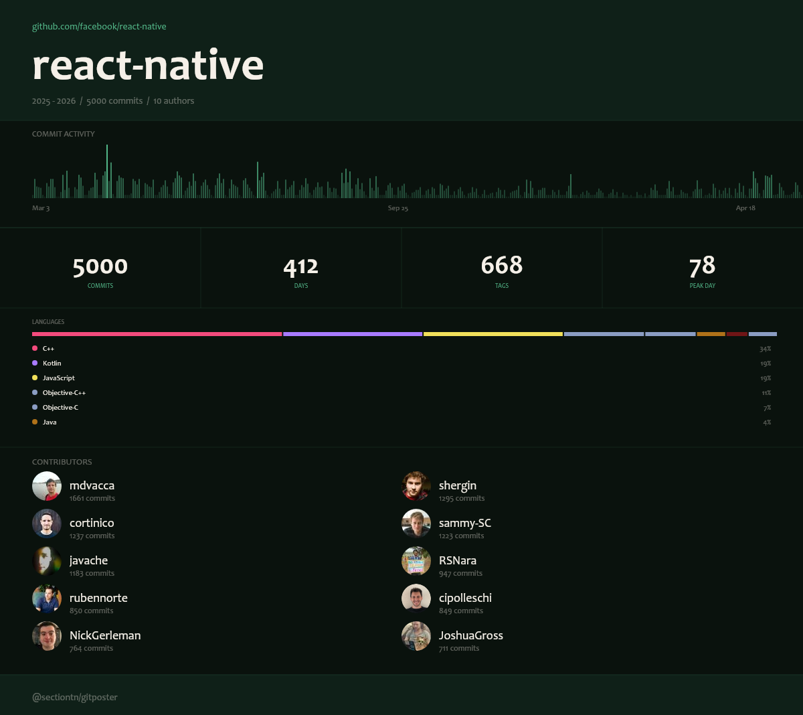

# gitposter

Takes a git repo and produces a PNG poster showing commit history, top contributors, language breakdown, and tagged milestones.



## Installation

```bash
npm install -g @sectiontn/gitposter
```

Or run without installing:

```bash
npx @sectiontn/gitposter <repo>
bunx @sectiontn/gitposter <repo>
```

## Usage

```bash
gitposter <owner/repo>           # GitHub repo
gitposter ./path/to/local/repo   # local path
```

### Options

| Flag | Description | Default |
|------|-------------|---------|
| `--theme <name>` | `dark`, `light`, `minimal`, `colorful` | `dark` |
| `--format <name>` | `poster` (1200x1800) or `square` (auto-height) | `poster` |
| `--all-themes` | One PNG per theme | — |
| `--max-commits <n>` | Limit commits fetched | `5000` |
| `--output <path>` | Output file path | `<repo>-<format>.png` |
| `--token <token>` | GitHub personal access token | `$GITHUB_TOKEN` |

### Examples

```bash
# basic dark poster
gitposter facebook/react --theme dark

# square for Twitter/Instagram
gitposter torvalds/linux --format square --theme minimal

# all four themes in one go
gitposter vercel/next.js --all-themes

# local repo
gitposter ./my-project --output my-project.png

# large repo, cap the commit fetch
gitposter microsoft/vscode --max-commits 2000
```

## GitHub token

Without a token you get 60 API requests per hour, which runs out fast on repos with many contributors. Set `GITHUB_TOKEN` or pass `--token`.

```bash
export GITHUB_TOKEN=ghp_...
gitposter owner/repo
```

## Requirements

Node >= 18

## License

MIT
